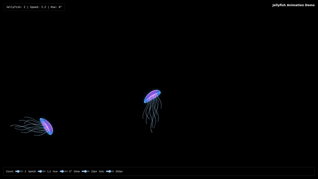
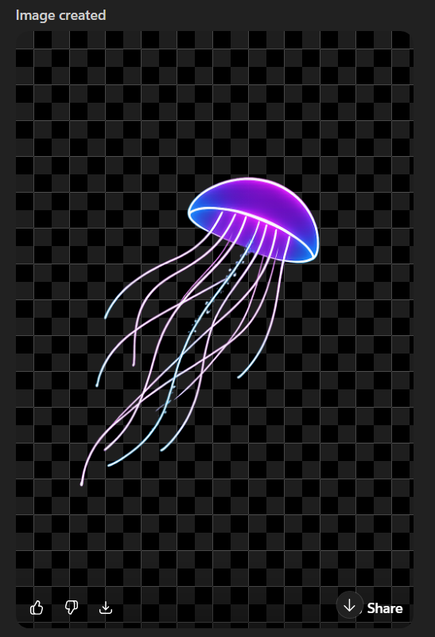
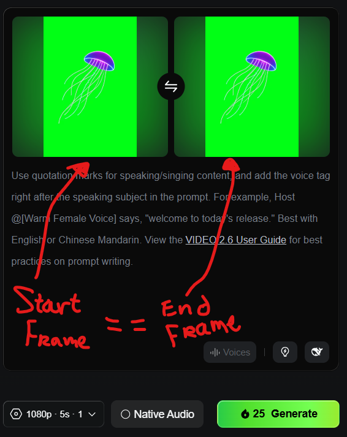
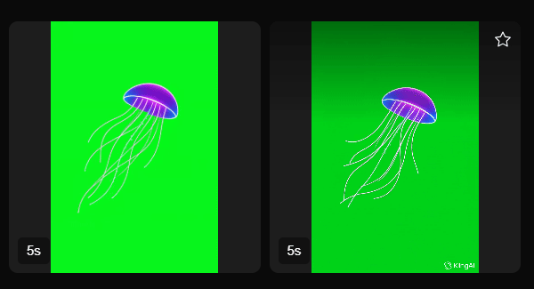

# Background Friends

## Jellyfish (WIP)

I wanted an animated jellyfish with a transparent background to exist as a React component that anyone could add to a background. Then you could have little jellyfish moving around to add some fun touches.

### Generating the Jellyfish

I asked OpenAI's ChatGPT to generate a jellyfish for me with a transparent background. I later used a tool to convert the transparent background to a bright green one.

### Animating the Jellyfish

When using the transparent background jellyfish, the background of these generated videos were not transparent or very friendly for making transparent. So I made the background green first with some [random online png editor](https://onlinepngtools.com/replace-alpha-channel-in-png).

[Kling O1](https://app.klingai.com/) offers a way to set the **start frame** and **end frame** of a video. If both are equivalent then we can get an infinite loop, in theory:

I generated a couple videos but despite modifying the prompt a little bit, the animation remained similar across generations. I also don't have unlimited money to burn, lol.

### Programming the Jellyfish

I used vibe-coding to describe what I was trying to do with my resulting `.mp4` from Kling O1. The result was some desired behavior, although I'm not satisfied with how it looks yet.

### Future Considerations

To give the animation more variety, perhaps there's a tool out there that can take in multiple frames to generate a video from. 

Or, you could also use the same start/end frames across multiple videos and merge them into 1 format.

I think programmatically (in the code) there's only so much I can do to make the jellyfish move around nicely. The animation is probably super important to really selling this idea.
